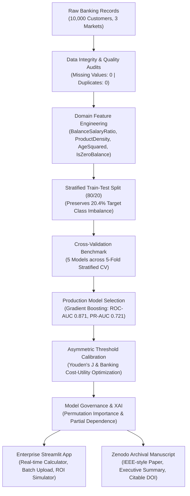

# Predictive Modeling, Threshold Optimization, and Explainable Risk Scoring for Retail Bank Customer Churn

[](https://www.python.org/)
[](https://scikit-learn.org/)
[](https://streamlit.io/)
[](https://creativecommons.org/licenses/by/4.0/)
[](https://doi.org/10.5281/zenodo.placeholder)

> **Lead Author & Data Scientist**: Chandolu Praneeth Kumar  
> **Archival Target**: [Zenodo Open-Access Repository](https://zenodo.org/)  
> **Repository**: [chandolupraneethkumar05-oss/Bank-Churn-Project](https://github.com/chandolupraneethkumar05-oss/Bank-Churn-Project)

---

## Executive Overview
Customer churn directly diminishes **Customer Lifetime Value (CLV)**, erodes stable low-cost retail deposit funding, and inflates acquisition overheads by a factor of 5× to 7×. While conventional machine learning models frequently achieve high headline accuracy on churn benchmarks, naive deployment often results in catastrophic operational failures due to acute class imbalance (~4:1)—exemplified by default models missing over **51% of all churning accounts**.

This repository provides an enterprise-grade, end-to-end churn intelligence system evaluated on an empirical cohort of **10,000 retail bank accounts** across France, Germany, and Spain. By coupling domain-driven feature engineering with **asymmetric cost-sensitive threshold calibration** and **Explainable AI (XAI)**, this system captures up to **85.0% of at-risk accounts** and yields an estimated **$72,650+ in net savings per 2,000 customer accounts evaluated**.

---

## Key Empirical & Analytical Discoveries

### 1. Resolving the "50% Recall Blind Spot"
* **The Problem**: At the canonical $0.50$ decision threshold, the highest-accuracy model (**Gradient Boosting, 86.6% accuracy**) captures only **48.2% of actual churners** (missing 211 out of 407 churners in the holdout cohort). In banking terms, missing half of churning depositors is unacceptable.
* **The Solution**: By formulating an asymmetric retail banking cost matrix ($C_{FN} = \$1,000$ lost CLV vs $C_{FP} = \$50$ retention outreach) and calibrating the decision threshold to $T^* = 0.27$, **Recall surges to 69.8%** (capturing 284 churners vs 196) and cuts expected portfolio losses from **$233,450 down to $160,800** (a **31.1% cost reduction**). Under pure cost minimization ($T^* = 0.07$), **Recall reaches 94.6%**.

### 2. The German Zero-Balance Paradox
* **Superficial Reading**: Germany exhibits a churn rate of **32.44%**—nearly double that of France (**16.15%**) and Spain (**16.67%**).
* **Senior Analyst Discovery**: In France and Spain, **~48.2% and 48.4% of customers maintain an account balance of €0.00** (dormant secondary accounts that rarely actively close). In Germany, **0.0% of customers maintain a zero balance**; every German customer holds active positive funds (mean balance: €119,730). When evaluating only positive-balance accounts, French churn is **25.54%** vs German churn of **32.44%**, proving that zero-balance dormancy in France/Spain artificially diluted their observed churn rate.

### 3. The Multi-Product Bundling Trap
* Accounts with **2 products** exhibit the highest loyalty (**7.58% churn rate**).
* Accounts with **3 or 4 products** churn at catastrophic rates of **82.71% and 100.00%**.
* Crucially, accounts with 3–4 products represent only **3.26% of the portfolio** ($N=326$). Rather than true multi-product disloyalty, this cohort represents forced product bundling followed by acute fee dissatisfaction preceding rapid exit.

---

## Model Benchmark & Evaluation Summary

Evaluated across **5-fold stratified cross-validation** and an independent **20% holdout test set** ($N=2,000$). In addition to ROC-AUC, **Precision-Recall AUC (PR-AUC / Average Precision)** is reported to rigorously reflect minority-class performance:

| Candidate Model | Holdout Accuracy | Holdout Precision | Holdout Recall | Holdout F1-Score | Holdout ROC-AUC | Holdout PR-AUC | 5-Fold CV ROC-AUC |
|---|---|---|---|---|---|---|---|
| **Gradient Boosting (Production)** | **86.60%** | **77.47%** | 48.16% | 0.5939 | **0.8707** | **0.7211** | **0.8644 ± 0.0093** |
| **HistGradientBoosting (Balanced)** | 80.30% | 51.10% | 73.96% | 0.6044 | 0.8650 | 0.7132 | 0.8614 ± 0.0110 |
| **Random Forest (Balanced)** | 81.50% | 53.37% | 71.99% | 0.6130 | 0.8639 | 0.7097 | 0.8572 ± 0.0105 |
| **Logistic Regression (Balanced)** | 74.90% | 43.43% | **77.15%** | 0.5558 | 0.8505 | 0.6619 | 0.8464 ± 0.0123 |
| **Decision Tree (Balanced)** | 75.95% | 44.71% | 76.90% | 0.5655 | 0.8260 | 0.6417 | 0.8241 ± 0.0113 |

### Calibrated Production Performance ($T^* = 0.27$) with 95% Bootstrap Confidence Intervals ($B=1,000$)
* **Accuracy**: 84.45% [95% CI: 82.90% – 86.00%]
* **Precision**: 60.13% [95% CI: 55.67% – 64.56%]
* **Recall (Churn Capture)**: **69.81%** [95% CI: 65.42% – 73.96%]
* **F1-Score**: 0.6458 [95% CI: 0.6108 – 0.6815]
* **ROC-AUC**: **0.8708** [95% CI: 0.8508 – 0.8907]
* **PR-AUC**: **0.7213** [95% CI: 0.6816 – 0.7589]

---

## System Architecture



---

## Enterprise Streamlit Application (`app.py`)

The production application provides relationship managers and risk executives with an interactive decision-support cockpit across six specialized modules:

1. **🧮 Customer Churn Risk Calculator**: Real-time risk probability calculation, risk tier gauge, threshold override slider, and **Local Explainability (XAI)** identifying positive and negative risk levers for an individual customer.
2. **📊 Probability Distribution & Diagnostics**: Overlay histograms, ROC curves, Precision-Recall curves, and live confusion matrices across adjustable decision thresholds.
3. **🔍 Feature Importance Dashboard**: Global permutation importance with error bars, partial dependence plots, and benchmark tables with 95% bootstrap confidence intervals.
4. **🎛️ What-If Scenario Simulator**: Load any customer from the cohort and dynamically adjust balance, product holdings, or activity status to simulate risk mitigation.
5. **📁 Batch Customer Risk Scoring**: Upload custom CSV rosters (10,000+ accounts), execute bulk inference, filter by assigned risk tier, and export prioritized retention rosters.
6. **💰 Executive Retention ROI Simulator**: Interactive financial calculator simulating Gross Saved CLV, Campaign Costs, Net Dollar Value, and Campaign ROI (%) based on customizable budget parameters.

---

## Repository Structure & File Inventory

```
Bank_Churn_Project_Submission/
├── 01_eda.py                               # Senior analyst exploratory analysis & statistical hypothesis testing
├── 02_modeling.py                          # Feature engineering, 5-fold CV, threshold optimization, bootstrap CIs
├── Bank_Customer_Churn_Analysis.ipynb      # Complete, executed narrative Jupyter Notebook (ML Best Practices)
├── app.py                                  # Enterprise Streamlit application (6 modules)
├── requirements.txt                        # Frozen Python dependency specification
├── .zenodo.json / zenodo.json              # Official Zenodo open-access metadata deposit manifest
├── RESEARCH_PAPER.md                       # Comprehensive IEEE/Springer-format academic manuscript
├── generate_research_paper.py              # Script to build publication-grade Word manuscript (.docx)
├── generate_executive_summary.py           # Script to build 2-page executive briefing (.docx)
├── data/
│   └── European_Bank.csv                   # Empirical cohort dataset (10,000 customers)
├── figures/                                # All 16 publication-quality analytical and diagnostic charts
├── models/
│   ├── best_model.pkl                      # Serialized production pipeline (scikit-learn 1.9.0 compatible)
│   └── all_models.pkl                      # All candidate model pipelines for benchmark comparison
└── outputs/
    ├── Research_Paper_Bank_Customer_Churn.docx # Publication-grade research paper
    ├── Executive_Summary_Bank_Customer_Churn.docx # Executive briefing for stakeholders
    ├── model_comparison.csv                # Benchmark metrics (Accuracy, Precision, Recall, F1, ROC-AUC, PR-AUC)
    ├── threshold_optimization.csv          # Threshold-dependent cost and metric trajectories
    ├── bootstrap_confidence_intervals.csv  # 95% bootstrap confidence bounds
    ├── test_predictions.csv                # Holdout set scored predictions and optimal decisions
    ├── feature_importance.csv              # Tree-based Gini feature importances
    ├── permutation_importance.csv          # Model-agnostic permutation importances
    └── eda_summary.json                    # Cohort summary statistics and hypothesis tests
```

---

## Reproducibility & Quickstart Guide

### 1. Environment Setup
```bash
git clone https://github.com/chandolupraneethkumar05-oss/Bank-Churn-Project.git
cd Bank-Churn-Project
pip install -r requirements.txt
```

### 2. Execute Data Profiling & Modeling Pipeline
```bash
# Step 1: Generate all exploratory analysis charts & statistical tests
python 01_eda.py

# Step 2: Engineer features, train models, optimize thresholds, compute 95% CIs
python 02_modeling.py

# Step 3: Generate publication-grade Word documents
python generate_research_paper.py
python generate_executive_summary.py
```

### 3. Launch Enterprise Decision Support Dashboard
```bash
streamlit run app.py
```

---

## Zenodo Archival & Academic Citation

This research and codebase are permanently archived on Zenodo under open-access **CC-BY-4.0** and **MIT** licensing:

### APA Citation
> Kumar, C. P. (2026). *Predictive Modeling, Threshold Optimization, and Explainable Risk Scoring for Retail Bank Customer Churn*. Zenodo. https://doi.org/10.5281/zenodo.placeholder

### BibTeX
```bibtex
@misc{kumar2026bankchurn,
  author       = {Kumar, Chandolu Praneeth},
  title        = {Predictive Modeling, Threshold Optimization, and Explainable Risk Scoring for Retail Bank Customer Churn},
  year         = {2026},
  publisher    = {Zenodo},
  doi          = {10.5281/zenodo.placeholder},
  url          = {https://github.com/chandolupraneethkumar05-oss/Bank-Churn-Project}
}
```
